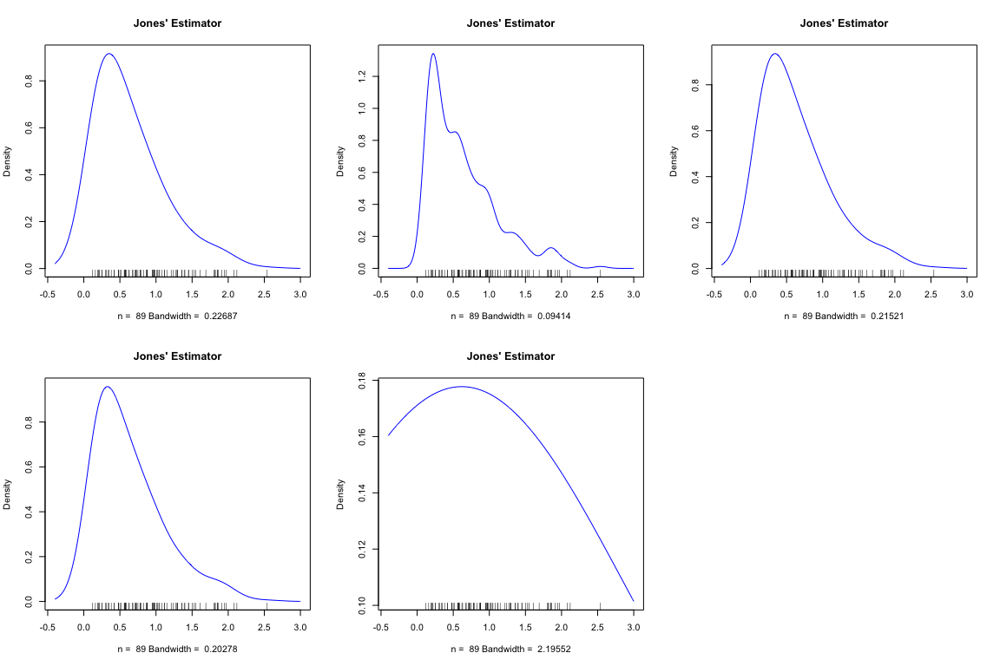
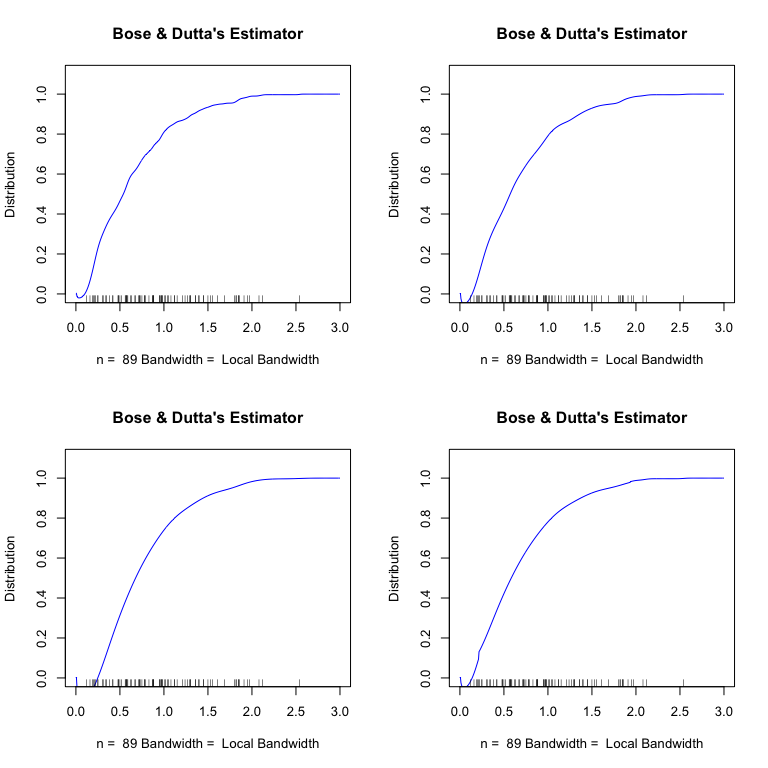
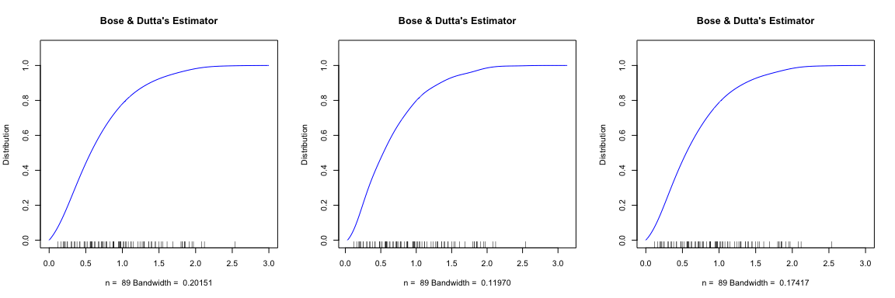

<!-- README.md is generated from README.Rmd. Please edit that file -->

#  WData

<!-- badges: start -->

[](https://github.com/noeliasanchmrt/WData/actions/workflows/R-CMD-check.yaml)
[](https://app.codecov.io/gh/noeliasanchmrt/WData)
<!-- badges: end -->

Set of tools for analyzing and modeling data that may be subject to
biases in sampling. It offers functions to estimate density functions,
cumulative distribution functions, and quantiles from biased samples of
a continuous distribution. Regarding density function estimation, the
package includes Bhattacharyya et al. (1988) and Jones (1991) density
estimators and various bandwidth selectors for Jones (1991) density
estimator, enhancing the flexibility and adaptability of density
estimation to different types of datasets and biases. For cumulative
distribution function estimation, the package includes the empirical
estimator proposed by Cox (2005) and the kernel-type estimator by Bose
and Dutta (2022), along with several bandwidth selectors for the latter.
For quantile function estimation, it provides two empirical estimators
(one of which corresponds to Sen (1984) proposal) and one kernel-type
estimator. Additionally, for sparsity function estimation, the package
includes the two estimators proposed by Akbari et al. (2019) (one
plug-in and one kernel-type), as well as a third kernel-type estimator.
Moreover, it offers functions for simulating datasets given a bias
function and a reference distribution, providing users with the ability
to generate synthetic datasets for various modeling and analysis
purposes. It also includes functions for constructing boxplots and QQ
plots for biased data, facilitating graphical exploration. Finally, the
package includes Muttlak (1988) real length-biased dataset on shrub
width as an example dataset.

## Installation

You can install the development version of WData from
[GitHub](https://github.com/) with:

``` r
# install.packages("devtools")
devtools::install_github("noeliasanchmrt/WData")
library(WData)
```

## Getting help

If you encounter a clear bug, please file an issue with a minimal
reproducible example on
[GitHub](https://github.com/tidyverse/dplyr/issues). For questions and
other discussion, please use [forum.posit.co](https://forum.posit.co/).

## Usage

### Real data

The species *Cercocarpus montanus*, commonly known as mountain mahogany,
is a deciduous shrub native to the western United States and northern
Mexico. It is typically found on slopes, canyons, and rocky, arid
formations with calcareous or other alkaline soils. This small shrub has
white flowers and oval-shaped leaves with serrated edges. It is highly
drought-tolerant and can survive even in nutrient-poor soils. Its
intricate root system prevents landslides on sloped terrains, while its
branches provide food and habitat for various animal species. These
characteristics make *Cercocarpus montanus* an ideal species for
studying wildlife recovery in a given geographic region.

During the fall semester of 1986, graduate students in a biological
sampling techniques course taught by Lyman L. McDonald at the University
of Wyoming conducted a study on the size of *Cercocarpus montanus* in an
old limestone quarry located just east of Laramie, Wyoming (United
States).

The sampling was conducted using line transect methods, which are widely
used in ecological studies to measure species abundance in a given area
and other relevant parameters. These methods involve randomly placing
parallel sampling lines (transects) across the study area. Researchers
traverse these lines, recording variables of interest.

To establish the sampling lines, a baseline was set across the study
region. Random positions were generated along this baseline following a
uniform distribution, and each sampling line was drawn perpendicularly
from these points. One limitation of this approach is the need for a
large number of transects to cover the area adequately. An alternative
method involves selecting a single random point along the baseline and
setting a fixed distance between transects. More details on variations
of this method can be found in Buckland et al. (2001).

The Laramie quarry was covered with north-south-oriented rock fissures.
Since moisture levels and vegetation density were higher in these
fissures, a baseline parallel to them was established. The transects
were drawn perpendicular to this baseline, crossing the terrain fissures
instead of running parallel to them. A distance of 41.6 meters was set
between transects, and two independent replicates (I and II) were
obtained, each with three equidistant parallel transects. In total, six
transects were surveyed from the baseline to the eastern boundary of the
quarry. Students traversed the transects, identifying *Cercocarpus
montanus* shrubs intersected by the line. For each shrub, its maximum
height, the number of main branches, and its width (the maximum distance
between two parallel tangent lines to the shrub’s contour along the
transect) were measured.

Since *Cercocarpus montanus* is a rhizomatous species and adjacent
shrubs may be interconnected via their root system, a shrub was defined
as an individual if it had a distinct cluster of stems at the base and
was at least 15 centimeters away from its nearest neighbor. For shrub
clusters, the length of their intersection with the transect was
recorded. More details on the sampling procedure and additional
measurements can be found in Muttlak (1988).

Due to the sampling method, wider shrubs had a higher probability of
being intersected by the transects. Consequently, the recorded shrub
widths represent a sample biased by longitudinal bias, meaning the bias
function is given by $w(x) = x$. The height and branch count
measurements were also subject to bias, although the bias function $w$
is more complex as it depends on the relationship between shrub width
and these respective variables.

``` r
summary(shrub.data)
summary(shrub.data$Width)
```

### Density estimation

#### `df.bhatta()`: Bhattacharyya et al. (1988) density estimator

``` r
library(WData)
par(mfrow = c(1, 3))
df.bhatta(shrub.data$Width, bw = "nrd0", kernel = "gaussian", from = -0.4, to = 3)
#> 
#> Call:
#>  df.bhatta(y = shrub.data$Width, bw = "nrd0", kernel = "gaussian",     from = -0.4, to = 3)
#> 
#> Data: y (89 obs.);   Bandwidth 'bw' = 0.2011
#> 
#>        x               y            
#>  Min.   :-0.40   Min.   : 0.000343  
#>  1st Qu.: 0.45   1st Qu.: 0.022069  
#>  Median : 1.30   Median : 0.147644  
#>  Mean   : 1.30   Mean   : 0.432512  
#>  3rd Qu.: 2.15   3rd Qu.: 0.582869  
#>  Max.   : 3.00   Max.   :16.776218  
#>                  NA's   :61
bw.ucv <- bw.ucv(shrub.data$Width, lower = 0.15, upper = 0.3)
df.bhatta(shrub.data$Width, bw = bw.ucv, kernel = "gaussian", from = -0.4, to = 3)
#> 
#> Call:
#>  df.bhatta(y = shrub.data$Width, bw = bw.ucv, kernel = "gaussian",     from = -0.4, to = 3)
#> 
#> Data: y (89 obs.);   Bandwidth 'bw' = 0.2696
#> 
#>        x               y           
#>  Min.   :-0.40   Min.   : 0.00085  
#>  1st Qu.: 0.45   1st Qu.: 0.02773  
#>  Median : 1.30   Median : 0.15356  
#>  Mean   : 1.30   Mean   : 0.44577  
#>  3rd Qu.: 2.15   3rd Qu.: 0.55339  
#>  Max.   : 3.00   Max.   :20.26203  
#>                  NA's   :61
df.bhatta(shrub.data$Width, bw = "SJ-ste", kernel = "gaussian", from = -0.3, to = 3)
```

<div class="figure" style="text-align: center">


<p class="caption">
Bhattacharyya et al. (1988) density estimator for shrub width.
</p>

</div>

    #> 
    #> Call:
    #>  df.bhatta(y = shrub.data$Width, bw = "SJ-ste", kernel = "gaussian",     from = -0.3, to = 3)
    #> 
    #> Data: y (89 obs.);   Bandwidth 'bw' = 0.2232
    #> 
    #>        x                y            
    #>  Min.   :-0.300   Min.   : 0.000508  
    #>  1st Qu.: 0.525   1st Qu.: 0.024325  
    #>  Median : 1.350   Median : 0.149939  
    #>  Mean   : 1.350   Mean   : 0.471471  
    #>  3rd Qu.: 2.175   3rd Qu.: 0.575482  
    #>  Max.   : 3.000   Max.   :29.654158  
    #>                   NA's   :47

#### `df.jones()`: Jones (1991) density estimator

The function allows different bandwidth selection methods:

- `"bw.f.BGMnrd0"`: Normal reference rule-of-thumb selector.
- `"bw.f.BGMcv"`: Cross-validation-based selector.
- `"bw.f.BGMboot1"`: Bootstrap-based selector (method 1).
- `"bw.f.BGMboot2"`: Bootstrap-based selector (method 2).

``` r
par(mfrow = c(2, 3))
df.jones(shrub.data$Width, kernel = "gaussian", bw = "bw.f.BGMnrd0", from = -0.4, to = 3)
#> Interval for Estimation: [-0.400000, 3.000000]
#> 
#> Call:
#>  df.jones(y = shrub.data$Width, bw = "bw.f.BGMnrd0", kernel = "gaussian",     from = -0.4, to = 3)
#> 
#> Data: y (89 obs.);   Bandwidth 'bw' = 0.2269
#> 
#>        x               y            
#>  Min.   :-0.40   Min.   :0.0006333  
#>  1st Qu.: 0.45   1st Qu.:0.0349071  
#>  Median : 1.30   Median :0.1553578  
#>  Mean   : 1.30   Mean   :0.2930519  
#>  3rd Qu.: 2.15   3rd Qu.:0.5231750  
#>  Max.   : 3.00   Max.   :0.9158924
df.jones(shrub.data$Width, kernel = "gaussian", bw = "bw.f.BGMcv", lower = 0.01, upper = 0.5, nh = 500L, from = -0.4, to = 3)
#> Interval for Estimation: [-0.400000, 3.000000]
#> Interval where bandwidth is searched: [0.010000, 0.500000]
#> 
#> Call:
#>  df.jones(y = shrub.data$Width, bw = "bw.f.BGMcv", kernel = "gaussian",     from = -0.4, to = 3, lower = 0.01, upper = 0.5, nh = 500L)
#> 
#> Data: y (89 obs.);   Bandwidth 'bw' = 0.09543
#> 
#>        x               y            
#>  Min.   :-0.40   Min.   :0.0000001  
#>  1st Qu.: 0.45   1st Qu.:0.0082395  
#>  Median : 1.30   Median :0.1175688  
#>  Mean   : 1.30   Mean   :0.2935432  
#>  3rd Qu.: 2.15   3rd Qu.:0.5142717  
#>  Max.   : 3.00   Max.   :1.3333035
df.jones(shrub.data$Width, kernel = "gaussian", bw = "bw.f.BGMboot1", from = -0.4, to = 3)
#> Interval for Estimation: [-0.400000, 3.000000]
#> Pilot Bandwidth for Bootstrap: 0.293207
#> 
#> Call:
#>  df.jones(y = shrub.data$Width, bw = "bw.f.BGMboot1", kernel = "gaussian",     from = -0.4, to = 3)
#> 
#> Data: y (89 obs.);   Bandwidth 'bw' = 0.2296
#> 
#>        x               y            
#>  Min.   :-0.40   Min.   :0.0006573  
#>  1st Qu.: 0.45   1st Qu.:0.0356574  
#>  Median : 1.30   Median :0.1572364  
#>  Mean   : 1.30   Mean   :0.2930086  
#>  3rd Qu.: 2.15   3rd Qu.:0.5234394  
#>  Max.   : 3.00   Max.   :0.9115050
df.jones(shrub.data$Width, kernel = "gaussian", bw = "bw.f.BGMboot1", bw0 = "Opt", from = -0.4, to = 3)
#> Interval for Estimation: [-0.400000, 3.000000]
#> Pilot Bandwidth for Bootstrap: 0.267953
#> 
#> Call:
#>  df.jones(y = shrub.data$Width, bw = "bw.f.BGMboot1", kernel = "gaussian",     from = -0.4, to = 3, bw0 = "Opt")
#> 
#> Data: y (89 obs.);   Bandwidth 'bw' = 0.217
#> 
#>        x               y            
#>  Min.   :-0.40   Min.   :0.0005452  
#>  1st Qu.: 0.45   1st Qu.:0.0323723  
#>  Median : 1.30   Median :0.1517084  
#>  Mean   : 1.30   Mean   :0.2931907  
#>  3rd Qu.: 2.15   3rd Qu.:0.5222767  
#>  Max.   : 3.00   Max.   :0.9323620
bw.f.BGMboot2 <- bw.f.BGMboot2(y = shrub.data$Width, from = 0.001, to = 3, nh = 200L, plot = F)
#> Interval where bandwidth is searched: [0.000161, 217.341159]
#> Interval where density is evaluated: [0.001000, 3.000000]
#> Pilot Bandwidth for Bootstrap: 0.075912
df.jones(shrub.data$Width, kernel = "gaussian", bw = bw.f.BGMboot2, from = -0.4, to = 3)
#> Interval for Estimation: [-0.400000, 3.000000]
#> 
#> Call:
#>  df.jones(y = shrub.data$Width, bw = bw.f.BGMboot2, kernel = "gaussian",     from = -0.4, to = 3)
#> 
#> Data: y (89 obs.);   Bandwidth 'bw' = 1.092
#> 
#>        x               y         
#>  Min.   :-0.40   Min.   :0.0470  
#>  1st Qu.: 0.45   1st Qu.:0.1444  
#>  Median : 1.30   Median :0.2596  
#>  Mean   : 1.30   Mean   :0.2297  
#>  3rd Qu.: 2.15   3rd Qu.:0.3155  
#>  Max.   : 3.00   Max.   :0.3369
```

<div class="figure" style="text-align: center">


<p class="caption">
Jones (1991) density estimator for shrub width.
</p>

</div>

### Distribution estimation

#### `cdf.cox()`: Cox (2005) distribution estimator

``` r
par(mfrow = c(1, 1))
plot(cdf.cox(shrub.data$Width), xlab = "", ylab = "", main = "", col = "blue", xlim = c(0, 3))
rug(shrub.data$Width)
```

<div class="figure" style="text-align: center">


<p class="caption">
Cox (2005) distribution estimator for shrub width.
</p>

</div>

#### Bose and Dutta (2022) distribution estimator

##### `bw.F.BD()`: Bose and Dutta (2022) local bandwidth selector

``` r
par(mfrow = c(2, 2))
cdf.bd(shrub.data$Width, correction = "left", from = 0, to = 3, bw = "bw.F.BD", c_adj = rep(0.25, 512))
#> Interval for Estimation: [0.000000, 3.000000]
#> 
#> Call:
#>  cdf.bd(y = shrub.data$Width, bw = "bw.F.BD", from = 0, to = 3,     correction = "left", c_adj = rep(0.25, 512))
#> 
#> Data: y (89 obs.);   Bandwidth 'bw' = 0.14570.14570.11560.1010.091770.085190.080170.076150.072840.070030.067620.06550.063630.061950.060440.059070.057810.056650.055590.054590.053670.05280.051990.051220.05050.049820.049170.048560.047970.047420.046880.046370.045880.045420.044970.044530.044120.043720.043330.042960.04260.042250.041910.041580.041260.040960.040660.040370.040080.039810.039540.039280.039030.038780.038540.038310.038080.037850.037630.037420.037210.037010.036810.036610.036420.036230.036050.035870.035690.035520.035350.035180.035020.034860.03470.034540.034390.034240.034090.033950.033810.033670.033530.03340.033260.033130.0330.032880.032750.032630.032510.032390.032270.032150.032040.031930.031810.03170.03160.031490.031380.031280.031180.031080.030980.030880.030780.030680.030590.03050.03040.030310.030220.030130.030040.029960.029870.029780.02970.029620.029530.029450.029370.029290.029210.029130.029060.028980.028910.028830.028760.028680.028610.028540.028470.02840.028330.028260.028190.028120.028050.027990.027920.027860.027790.027730.027670.02760.027540.027480.027420.027360.02730.027240.027180.027120.027060.0270.026950.026890.026830.026780.026720.026670.026610.026560.026510.026450.02640.026350.02630.026250.026190.026140.026090.026040.025990.025950.02590.025850.02580.025750.025710.025660.025610.025570.025520.025470.025430.025380.025340.02530.025250.025210.025160.025120.025080.025040.024990.024950.024910.024870.024830.024790.024750.024710.024670.024630.024590.024550.024510.024470.024430.024390.024350.024320.024280.024240.02420.024170.024130.024090.024060.024020.023990.023950.023920.023880.023850.023810.023780.023740.023710.023670.023640.023610.023570.023540.023510.023470.023440.023410.023380.023340.023310.023280.023250.023220.023190.023160.023120.023090.023060.023030.0230.022970.022940.022910.022880.022850.022820.022790.022770.022740.022710.022680.022650.022620.022590.022570.022540.022510.022480.022460.022430.02240.022370.022350.022320.022290.022270.022240.022210.022190.022160.022140.022110.022080.022060.022030.022010.021980.021960.021930.021910.021880.021860.021830.021810.021790.021760.021740.021710.021690.021670.021640.021620.021590.021570.021550.021520.02150.021480.021460.021430.021410.021390.021360.021340.021320.02130.021280.021250.021230.021210.021190.021170.021140.021120.02110.021080.021060.021040.021020.0210.020980.020950.020930.020910.020890.020870.020850.020830.020810.020790.020770.020750.020730.020710.020690.020670.020650.020630.020610.020590.020570.020550.020530.020520.02050.020480.020460.020440.020420.02040.020380.020370.020350.020330.020310.020290.020270.020260.020240.020220.02020.020180.020170.020150.020130.020110.020090.020080.020060.020040.020020.020010.019990.019970.019960.019940.019920.01990.019890.019870.019850.019840.019820.01980.019790.019770.019750.019740.019720.019710.019690.019670.019660.019640.019620.019610.019590.019580.019560.019550.019530.019510.01950.019480.019470.019450.019440.019420.019410.019390.019380.019360.019350.019330.019320.01930.019290.019270.019260.019240.019230.019210.01920.019180.019170.019150.019140.019120.019110.01910.019080.019070.019050.019040.019020.019010.0190.018980.018970.018950.018940.018930.018910.01890.018880.018870.018860.018840.018830.018820.01880.018790.018780.018760.018750.018740.018720.018710.01870.018680.018670.018660.018640.018630.018620.018610.018590.018580.018570.018550.018540.018530.018520.01850.018490.018480.018470.018450.018440.018430.018420.01840.018390.018380.018370.018350.018340.018330.018320.018310.018290.018280.018270.018260.018250.018230.01822
#> 
#>        x              y           
#>  Min.   :0.00   Min.   :-0.01986  
#>  1st Qu.:0.75   1st Qu.: 0.67113  
#>  Median :1.50   Median : 0.93437  
#>  Mean   :1.50   Mean   : 0.78287  
#>  3rd Qu.:2.25   3rd Qu.: 0.99711  
#>  Max.   :3.00   Max.   : 1.00000
cdf.bd(shrub.data$Width, correction = "left", from = 0, to = 3, bw = "bw.F.BD", c_adj = rep(0.5, 512))
#> Interval for Estimation: [0.000000, 3.000000]
#> 
#> Call:
#>  cdf.bd(y = shrub.data$Width, bw = "bw.F.BD", from = 0, to = 3,     correction = "left", c_adj = rep(0.5, 512))
#> 
#> Data: y (89 obs.);   Bandwidth 'bw' = 0.29130.29130.23120.2020.18350.17040.16030.15230.14570.14010.13520.1310.12730.12390.12090.11810.11560.11330.11120.10920.10730.10560.1040.10240.1010.099640.098350.097120.095950.094830.093760.092750.091770.090830.089930.089070.088240.087430.086660.085910.085190.084490.083820.083160.082530.081910.081310.080730.080170.079620.079080.078560.078060.077560.077080.076610.076150.07570.075270.074840.074420.074010.073610.073220.072840.072460.072090.071730.071380.071030.070690.070360.070030.069710.06940.069090.068780.068480.068190.06790.067620.067340.067060.066790.066530.066260.066010.065750.06550.065260.065010.064770.064540.064310.064080.063850.063630.063410.063190.062980.062770.062560.062360.062150.061950.061760.061560.061370.061180.060990.060810.060620.060440.060260.060090.059910.059740.059570.05940.059230.059070.05890.058740.058580.058430.058270.058120.057960.057810.057660.057510.057370.057220.057080.056930.056790.056650.056520.056380.056240.056110.055980.055850.055710.055590.055460.055330.05520.055080.054960.054830.054710.054590.054470.054360.054240.054120.054010.053890.053780.053670.053560.053450.053340.053230.053120.053010.052910.05280.05270.052590.052490.052390.052290.052190.052090.051990.051890.051790.05170.05160.051510.051410.051320.051220.051130.051040.050950.050860.050770.050680.050590.05050.050420.050330.050240.050160.050070.049990.04990.049820.049740.049660.049570.049490.049410.049330.049250.049170.049090.049020.048940.048860.048790.048710.048630.048560.048480.048410.048340.048260.048190.048120.048040.047970.04790.047830.047760.047690.047620.047550.047480.047420.047350.047280.047210.047150.047080.047010.046950.046880.046820.046750.046690.046620.046560.04650.046440.046370.046310.046250.046190.046130.046070.0460.045940.045880.045830.045770.045710.045650.045590.045530.045470.045420.045360.04530.045250.045190.045130.045080.045020.044970.044910.044860.04480.044750.044690.044640.044590.044530.044480.044430.044380.044320.044270.044220.044170.044120.044070.044020.043970.043920.043870.043820.043770.043720.043670.043620.043570.043520.043470.043430.043380.043330.043280.043240.043190.043140.04310.043050.0430.042960.042910.042870.042820.042770.042730.042680.042640.04260.042550.042510.042460.042420.042380.042330.042290.042250.04220.042160.042120.042080.042030.041990.041950.041910.041870.041830.041780.041740.04170.041660.041620.041580.041540.04150.041460.041420.041380.041340.04130.041260.041220.041190.041150.041110.041070.041030.040990.040960.040920.040880.040840.04080.040770.040730.040690.040660.040620.040580.040550.040510.040470.040440.04040.040370.040330.040290.040260.040220.040190.040150.040120.040080.040050.040010.039980.039950.039910.039880.039840.039810.039780.039740.039710.039670.039640.039610.039580.039540.039510.039480.039440.039410.039380.039350.039310.039280.039250.039220.039190.039150.039120.039090.039060.039030.0390.038970.038940.03890.038870.038840.038810.038780.038750.038720.038690.038660.038630.03860.038570.038540.038510.038480.038450.038420.038390.038360.038330.038310.038280.038250.038220.038190.038160.038130.03810.038080.038050.038020.037990.037960.037940.037910.037880.037850.037820.03780.037770.037740.037710.037690.037660.037630.037610.037580.037550.037530.03750.037470.037450.037420.037390.037370.037340.037310.037290.037260.037240.037210.037180.037160.037130.037110.037080.037060.037030.037010.036980.036960.036930.036910.036880.036860.036830.036810.036780.036760.036730.036710.036680.036660.036630.036610.036590.036560.036540.036510.036490.036470.03644
#> 
#>        x              y           
#>  Min.   :0.00   Min.   :-0.05002  
#>  1st Qu.:0.75   1st Qu.: 0.64369  
#>  Median :1.50   Median : 0.92949  
#>  Mean   :1.50   Mean   : 0.76841  
#>  3rd Qu.:2.25   3rd Qu.: 0.99690  
#>  Max.   :3.00   Max.   : 1.00000
cdf.bd(shrub.data$Width, correction = "left", from = 0, to = 3, bw = "bw.F.BD", c_adj = rep(1.3, 512))
#> Interval for Estimation: [0.000000, 3.000000]
#> 
#> Call:
#>  cdf.bd(y = shrub.data$Width, bw = "bw.F.BD", from = 0, to = 3,     correction = "left", c_adj = rep(1.3, 512))
#> 
#> Data: y (89 obs.);   Bandwidth 'bw' = 0.75750.75750.60120.52520.47720.4430.41690.3960.37880.36420.35160.34060.33090.32220.31430.30720.30060.29460.2890.28390.27910.27460.27030.26640.26260.25910.25570.25250.24950.24660.24380.24110.23860.23620.23380.23160.22940.22730.22530.22340.22150.21970.21790.21620.21460.2130.21140.20990.20840.2070.20560.20430.20290.20170.20040.19920.1980.19680.19570.19460.19350.19240.19140.19040.18940.18840.18740.18650.18560.18470.18380.18290.18210.18130.18040.17960.17880.17810.17730.17650.17580.17510.17440.17370.1730.17230.17160.1710.17030.16970.1690.16840.16780.16720.16660.1660.16540.16490.16430.16370.16320.16270.16210.16160.16110.16060.16010.15960.15910.15860.15810.15760.15720.15670.15620.15580.15530.15490.15440.1540.15360.15320.15270.15230.15190.15150.15110.15070.15030.14990.14950.14920.14880.14840.1480.14770.14730.14690.14660.14620.14590.14550.14520.14490.14450.14420.14390.14350.14320.14290.14260.14230.14190.14160.14130.1410.14070.14040.14010.13980.13950.13920.1390.13870.13840.13810.13780.13760.13730.1370.13670.13650.13620.13590.13570.13540.13520.13490.13470.13440.13420.13390.13370.13340.13320.13290.13270.13250.13220.1320.13180.13150.13130.13110.13090.13060.13040.13020.130.12970.12950.12930.12910.12890.12870.12850.12830.12810.12780.12760.12740.12720.1270.12680.12660.12640.12630.12610.12590.12570.12550.12530.12510.12490.12470.12450.12440.12420.1240.12380.12360.12350.12330.12310.12290.12280.12260.12240.12220.12210.12190.12170.12160.12140.12120.12110.12090.12070.12060.12040.12020.12010.11990.11980.11960.11950.11930.11910.1190.11880.11870.11850.11840.11820.11810.11790.11780.11760.11750.11730.11720.11710.11690.11680.11660.11650.11630.11620.11610.11590.11580.11570.11550.11540.11520.11510.1150.11480.11470.11460.11440.11430.11420.11410.11390.11380.11370.11350.11340.11330.11320.1130.11290.11280.11270.11250.11240.11230.11220.1120.11190.11180.11170.11160.11140.11130.11120.11110.1110.11090.11070.11060.11050.11040.11030.11020.11010.110.10980.10970.10960.10950.10940.10930.10920.10910.1090.10890.10870.10860.10850.10840.10830.10820.10810.1080.10790.10780.10770.10760.10750.10740.10730.10720.10710.1070.10690.10680.10670.10660.10650.10640.10630.10620.10610.1060.10590.10580.10570.10560.10550.10540.10530.10520.10510.1050.1050.10490.10480.10470.10460.10450.10440.10430.10420.10410.1040.10390.10390.10380.10370.10360.10350.10340.10330.10320.10320.10310.1030.10290.10280.10270.10260.10260.10250.10240.10230.10220.10210.1020.1020.10190.10180.10170.10160.10160.10150.10140.10130.10120.10120.10110.1010.10090.10080.10080.10070.10060.10050.10040.10040.10030.10020.10010.10010.099970.09990.099820.099750.099670.099590.099520.099440.099370.099290.099220.099150.099070.0990.098920.098850.098780.098710.098630.098560.098490.098420.098340.098270.09820.098130.098060.097990.097920.097850.097780.097710.097640.097570.09750.097430.097360.097290.097220.097150.097090.097020.096950.096880.096810.096750.096680.096610.096550.096480.096410.096350.096280.096220.096150.096080.096020.095950.095890.095820.095760.09570.095630.095570.09550.095440.095380.095310.095250.095190.095120.095060.0950.094940.094870.094810.09475
#> 
#>        x              y          
#>  Min.   :0.00   Min.   :-0.1191  
#>  1st Qu.:0.75   1st Qu.: 0.5638  
#>  Median :1.50   Median : 0.9118  
#>  Mean   :1.50   Mean   : 0.7283  
#>  3rd Qu.:2.25   3rd Qu.: 0.9956  
#>  Max.   :3.00   Max.   : 1.0000
c_adj <- ifelse(seq(from = 0, to = 3, length.out = 512) <= quantile(shrub.data$Width, 0.05) |
  seq(from = 0, to = 3, length.out = 512) >= quantile(shrub.data$Width, 0.95), 0.5, 1.3)
cdf.bd(shrub.data$Width, correction = "left", from = 0, to = 3, bw = "bw.F.BD", c_adj = c_adj)
#> Interval for Estimation: [0.000000, 3.000000]
```

<div class="figure" style="text-align: center">


<p class="caption">
Bose and Dutta (2022) distribution estimator for shrub width using local
bandwiths.
</p>

</div>

    #> 
    #> Call:
    #>  cdf.bd(y = shrub.data$Width, bw = "bw.F.BD", from = 0, to = 3,     correction = "left", c_adj = c_adj)
    #> 
    #> Data: y (89 obs.);   Bandwidth 'bw' = 0.29130.29130.23120.2020.18350.17040.16030.15230.14570.14010.13520.1310.12730.12390.12090.11810.11560.11330.11120.10920.10730.10560.1040.10240.1010.099640.098350.097120.095950.094830.093760.092750.091770.090830.089930.089070.088240.22730.22530.22340.22150.21970.21790.21620.21460.2130.21140.20990.20840.2070.20560.20430.20290.20170.20040.19920.1980.19680.19570.19460.19350.19240.19140.19040.18940.18840.18740.18650.18560.18470.18380.18290.18210.18130.18040.17960.17880.17810.17730.17650.17580.17510.17440.17370.1730.17230.17160.1710.17030.16970.1690.16840.16780.16720.16660.1660.16540.16490.16430.16370.16320.16270.16210.16160.16110.16060.16010.15960.15910.15860.15810.15760.15720.15670.15620.15580.15530.15490.15440.1540.15360.15320.15270.15230.15190.15150.15110.15070.15030.14990.14950.14920.14880.14840.1480.14770.14730.14690.14660.14620.14590.14550.14520.14490.14450.14420.14390.14350.14320.14290.14260.14230.14190.14160.14130.1410.14070.14040.14010.13980.13950.13920.1390.13870.13840.13810.13780.13760.13730.1370.13670.13650.13620.13590.13570.13540.13520.13490.13470.13440.13420.13390.13370.13340.13320.13290.13270.13250.13220.1320.13180.13150.13130.13110.13090.13060.13040.13020.130.12970.12950.12930.12910.12890.12870.12850.12830.12810.12780.12760.12740.12720.1270.12680.12660.12640.12630.12610.12590.12570.12550.12530.12510.12490.12470.12450.12440.12420.1240.12380.12360.12350.12330.12310.12290.12280.12260.12240.12220.12210.12190.12170.12160.12140.12120.12110.12090.12070.12060.12040.12020.12010.11990.11980.11960.11950.11930.11910.1190.11880.11870.11850.11840.11820.11810.11790.11780.11760.11750.11730.11720.11710.11690.11680.11660.11650.11630.11620.11610.11590.11580.11570.11550.11540.11520.11510.1150.11480.11470.11460.11440.11430.11420.11410.11390.11380.11370.11350.11340.11330.11320.1130.11290.11280.11270.11250.11240.11230.11220.1120.11190.11180.11170.11160.11140.11130.11120.11110.1110.11090.11070.11060.11050.11040.11030.11020.11010.110.10980.10970.042160.042120.042080.042030.041990.041950.041910.041870.041830.041780.041740.04170.041660.041620.041580.041540.04150.041460.041420.041380.041340.04130.041260.041220.041190.041150.041110.041070.041030.040990.040960.040920.040880.040840.04080.040770.040730.040690.040660.040620.040580.040550.040510.040470.040440.04040.040370.040330.040290.040260.040220.040190.040150.040120.040080.040050.040010.039980.039950.039910.039880.039840.039810.039780.039740.039710.039670.039640.039610.039580.039540.039510.039480.039440.039410.039380.039350.039310.039280.039250.039220.039190.039150.039120.039090.039060.039030.0390.038970.038940.03890.038870.038840.038810.038780.038750.038720.038690.038660.038630.03860.038570.038540.038510.038480.038450.038420.038390.038360.038330.038310.038280.038250.038220.038190.038160.038130.03810.038080.038050.038020.037990.037960.037940.037910.037880.037850.037820.03780.037770.037740.037710.037690.037660.037630.037610.037580.037550.037530.03750.037470.037450.037420.037390.037370.037340.037310.037290.037260.037240.037210.037180.037160.037130.037110.037080.037060.037030.037010.036980.036960.036930.036910.036880.036860.036830.036810.036780.036760.036730.036710.036680.036660.036630.036610.036590.036560.036540.036510.036490.036470.03644
    #> 
    #>        x              y           
    #>  Min.   :0.00   Min.   :-0.05002  
    #>  1st Qu.:0.75   1st Qu.: 0.63277  
    #>  Median :1.50   Median : 0.92571  
    #>  Mean   :1.50   Mean   : 0.76489  
    #>  3rd Qu.:2.25   3rd Qu.: 0.99690  
    #>  Max.   :3.00   Max.   : 1.00000

##### `bw.F.SBCnrd0()`, `bw.F.SBCcv()`and `bw.F.SBCpi()`: Global bandwidth selectors

``` r
par(mfrow = c(1, 3))
cdf.bd(shrub.data$Width, from = 0, to = 3, correction = "left")
#> Interval for Estimation: [0.000000, 3.000000]
#> 
#> Call:
#>  cdf.bd(y = shrub.data$Width, from = 0, to = 3, correction = "left")
#> 
#> Data: y (89 obs.);   Bandwidth 'bw' = 0.2015
#> 
#>        x              y         
#>  Min.   :0.00   Min.   :0.0000  
#>  1st Qu.:0.75   1st Qu.:0.6399  
#>  Median :1.50   Median :0.9237  
#>  Mean   :1.50   Mean   :0.7735  
#>  3rd Qu.:2.25   3rd Qu.:0.9943  
#>  Max.   :3.00   Max.   :1.0000
bw_cv <- bw.F.SBCcv(shrub.data$Width, lower = 0.05, upper = 0.2, nh = 250, plot = F)
#> Interval where bandwidth is searched: [0.050000, 0.200000]
cdf.bd(shrub.data$Width, correction = "left", bw = bw_cv)
#> Interval for Estimation: [0.080000, 2.960000]
#> 
#> Call:
#>  cdf.bd(y = shrub.data$Width, bw = bw_cv, correction = "left")
#> 
#> Data: y (89 obs.);   Bandwidth 'bw' = 0.1199
#> 
#>        x              y         
#>  Min.   :0.08   Min.   :0.0000  
#>  1st Qu.:0.80   1st Qu.:0.6839  
#>  Median :1.52   Median :0.9319  
#>  Mean   :1.52   Mean   :0.7944  
#>  3rd Qu.:2.24   3rd Qu.:0.9961  
#>  Max.   :2.96   Max.   :1.0000
cdf.bd(shrub.data$Width, from = 0, to = 3, correction = "left", bw = "bw.F.SBCpi")
#> Interval for Estimation: [0.000000, 3.000000]
#> Pilot Bandwidth: 0.214138
```

<div class="figure" style="text-align: center">


<p class="caption">
Bose and Dutta (2022) distribution estimator for shrub width using
global bandwiths.
</p>

</div>

    #> 
    #> Call:
    #>  cdf.bd(y = shrub.data$Width, bw = "bw.F.SBCpi", from = 0, to = 3,     correction = "left")
    #> 
    #> Data: y (89 obs.);   Bandwidth 'bw' = 0.2068
    #> 
    #>        x              y         
    #>  Min.   :0.00   Min.   :0.0000  
    #>  1st Qu.:0.75   1st Qu.:0.6379  
    #>  Median :1.50   Median :0.9232  
    #>  Mean   :1.50   Mean   :0.7727  
    #>  3rd Qu.:2.25   3rd Qu.:0.9942  
    #>  Max.   :3.00   Max.   :1.0000

#### `cdf.efro()`: Efromovich (2008) series distribution estimator

``` r
par(mfrow = c(2, 4))
cdf.efro(shrub.data$Width)
#> Interval for Estimation: [0.080000, 2.960000]
#> Coefficient of difficulty due to biasing: 1.75791
#> Optimal Cutoff J: 2
#> Cutoff Value for High Frequency Terms U: 0.21102
#> Number of High Frequency Terms Included: 0
#> Interval where c is searched: [-1.100184, 2.442850]
#> Optimal Value for c: -0.99336
#> Value of the Estimator Integral: 1.00267
```


### Quantile estimation

#### `qf.sen()`and `qf.sen()`: Empirical quantile estimators

``` r
par(mfrow = c(1, 2))
plot(qf.sen(shrub.data$Width), xlab = "", ylab = "", col = "blue", main = "Empirical quantile estimator (qf.sen)")
plot(qf.SBC(shrub.data$Width), xlab = "", ylab = "", col = "blue", main = "Empirical quantile estimator (qf.SBC)")
```

<div class="figure" style="text-align: center">


<p class="caption">
Empirical quantile estimators for shrub width.
</p>

</div>

#### `qf.SBCkernel()`: Kernel quantile estimator

``` r
par(mfrow = c(1, 4))
qf.SBCkernel(shrub.data$Width, kernel = "epanechnikov", bw = 0.01)
#> Interval for Estimation: [0.010000, 0.990000]
#> 
#> Call:
#>  qf.SBCkernel(y = shrub.data$Width, bw = 0.01, kernel = "epanechnikov")
#> 
#> Data: y (89 obs.);   Bandwidth 'bw' = 0.01
#> 
#>        x               y         
#>  Min.   :0.010   Min.   :0.1146  
#>  1st Qu.:0.255   1st Qu.:0.2326  
#>  Median :0.500   Median :0.4941  
#>  Mean   :0.500   Mean   :0.6016  
#>  3rd Qu.:0.745   3rd Qu.:0.8447  
#>  Max.   :0.990   Max.   :1.9721
qf.SBCkernel(shrub.data$Width, kernel = "epanechnikov", bw = 0.05)
#> Interval for Estimation: [0.010000, 0.990000]
#> 
#> Call:
#>  qf.SBCkernel(y = shrub.data$Width, bw = 0.05, kernel = "epanechnikov")
#> 
#> Data: y (89 obs.);   Bandwidth 'bw' = 0.05
#> 
#>        x               y          
#>  Min.   :0.010   Min.   :0.07508  
#>  1st Qu.:0.255   1st Qu.:0.23229  
#>  Median :0.500   Median :0.50193  
#>  Mean   :0.500   Mean   :0.58866  
#>  3rd Qu.:0.745   3rd Qu.:0.84423  
#>  Max.   :0.990   Max.   :1.62474
qf.SBCkernel(shrub.data$Width, kernel = "epanechnikov", bw = 0.10)
#> Interval for Estimation: [0.010000, 0.990000]
#> 
#> Call:
#>  qf.SBCkernel(y = shrub.data$Width, bw = 0.1, kernel = "epanechnikov")
#> 
#> Data: y (89 obs.);   Bandwidth 'bw' = 0.1
#> 
#>        x               y          
#>  Min.   :0.010   Min.   :0.07501  
#>  1st Qu.:0.255   1st Qu.:0.23734  
#>  Median :0.500   Median :0.49917  
#>  Mean   :0.500   Mean   :0.57216  
#>  3rd Qu.:0.745   3rd Qu.:0.84096  
#>  Max.   :0.990   Max.   :1.36825
qf.SBCkernel(shrub.data$Width, kernel = "epanechnikov", bw = 0.25)
#> Interval for Estimation: [0.010000, 0.990000]
```

<div class="figure" style="text-align: center">


<p class="caption">
Kernel quantile estimator for shrub width.
</p>

</div>

    #> 
    #> Call:
    #>  qf.SBCkernel(y = shrub.data$Width, bw = 0.25, kernel = "epanechnikov")
    #> 
    #> Data: y (89 obs.);   Bandwidth 'bw' = 0.25
    #> 
    #>        x               y          
    #>  Min.   :0.010   Min.   :0.08527  
    #>  1st Qu.:0.255   1st Qu.:0.25643  
    #>  Median :0.500   Median :0.49650  
    #>  Mean   :0.500   Mean   :0.53028  
    #>  3rd Qu.:0.745   3rd Qu.:0.80851  
    #>  Max.   :0.990   Max.   :0.99935

### Sparsity estimation

#### `sp.akbaripi()`: Akbari et al. (2019) plug-in sparsity estimator

``` r
par(mfrow = c(1, 4))
sp.akbaripi(shrub.data$Width, bw = 0.01, kernel = "epanechnikov")
#> Interval for Estimation: [0.120000, 2.540000]
#> Empirical QF 
#> Call: sp.akbaripi(shrub.data$Width, bw = 0.01, kernel = "epanechnikov")
#>  x[1:89] = 0.059043, 0.10333, 0.14062,  ..., 0.99721,      1
sp.akbaripi(shrub.data$Width, bw = 0.05, kernel = "epanechnikov")
#> Interval for Estimation: [0.120000, 2.540000]
#> Empirical QF 
#> Call: sp.akbaripi(shrub.data$Width, bw = 0.05, kernel = "epanechnikov")
#>  x[1:89] = 0.059043, 0.10333, 0.14062,  ..., 0.99721,      1
sp.akbaripi(shrub.data$Width, bw = 0.10, kernel = "epanechnikov")
#> Interval for Estimation: [0.120000, 2.540000]
#> Empirical QF 
#> Call: sp.akbaripi(shrub.data$Width, bw = 0.1, kernel = "epanechnikov")
#>  x[1:89] = 0.059043, 0.10333, 0.14062,  ..., 0.99721,      1
sp.akbaripi(shrub.data$Width, bw = 0.25, kernel = "epanechnikov")
#> Interval for Estimation: [0.120000, 2.540000]
#> Empirical QF 
#> Call: sp.akbaripi(shrub.data$Width, bw = 0.25, kernel = "epanechnikov")
#>  x[1:89] = 0.059043, 0.10333, 0.14062,  ..., 0.99721,      1
```

#### `sp.akbarikernel()`: Kernel sparsity estimator

``` r
par(mfrow = c(1, 4))
sp.akbarikernel(shrub.data$Width, bw = 0.01, kernel = "epanechnikov")
#> Interval for Estimation: [0.010000, 0.990000]
#> 
#> Call:
#>  sp.akbarikernel(y = shrub.data$Width, bw = 0.01, kernel = "epanechnikov")
#> 
#> Data: y (89 obs.);   Bandwidth 'bw' = 0.01
#> 
#>        x               y          
#>  Min.   :0.010   Min.   : 0.0000  
#>  1st Qu.:0.255   1st Qu.: 0.1128  
#>  Median :0.500   Median : 1.0578  
#>  Mean   :0.500   Mean   : 2.0284  
#>  3rd Qu.:0.745   3rd Qu.: 2.7247  
#>  Max.   :0.990   Max.   :16.3964
sp.akbarikernel(shrub.data$Width, bw = 0.05, kernel = "epanechnikov")
#> Interval for Estimation: [0.010000, 0.990000]
#> 
#> Call:
#>  sp.akbarikernel(y = shrub.data$Width, bw = 0.05, kernel = "epanechnikov")
#> 
#> Data: y (89 obs.);   Bandwidth 'bw' = 0.05
#> 
#>        x               y           
#>  Min.   :0.010   Min.   : 0.06824  
#>  1st Qu.:0.255   1st Qu.: 0.91352  
#>  Median :0.500   Median : 1.42181  
#>  Mean   :0.500   Mean   : 2.18228  
#>  3rd Qu.:0.745   3rd Qu.: 1.96606  
#>  Max.   :0.990   Max.   :13.38425
sp.akbarikernel(shrub.data$Width, bw = 0.10, kernel = "epanechnikov")
#> Interval for Estimation: [0.010000, 0.990000]
#> 
#> Call:
#>  sp.akbarikernel(y = shrub.data$Width, bw = 0.1, kernel = "epanechnikov")
#> 
#> Data: y (89 obs.);   Bandwidth 'bw' = 0.1
#> 
#>        x               y         
#>  Min.   :0.010   Min.   :0.4573  
#>  1st Qu.:0.255   1st Qu.:1.0439  
#>  Median :0.500   Median :1.2886  
#>  Mean   :0.500   Mean   :2.0995  
#>  3rd Qu.:0.745   3rd Qu.:1.8851  
#>  Max.   :0.990   Max.   :8.8587
sp.akbarikernel(shrub.data$Width, bw = 0.25, kernel = "epanechnikov")
#> Interval for Estimation: [0.010000, 0.990000]
```

<div class="figure" style="text-align: center">


<p class="caption">
Akbari et al. (2019) kernel sparsity estimator for shrub width.
</p>

</div>

    #> 
    #> Call:
    #>  sp.akbarikernel(y = shrub.data$Width, bw = 0.25, kernel = "epanechnikov")
    #> 
    #> Data: y (89 obs.);   Bandwidth 'bw' = 0.25
    #> 
    #>        x               y         
    #>  Min.   :0.010   Min.   :0.5466  
    #>  1st Qu.:0.255   1st Qu.:0.9148  
    #>  Median :0.500   Median :1.2725  
    #>  Mean   :0.500   Mean   :1.9144  
    #>  3rd Qu.:0.745   3rd Qu.:2.5075  
    #>  Max.   :0.990   Max.   :4.7694

#### `sp.SBC()`: Kernel sparsity estimator based on Cox (2005) distribution estimator

``` r
par(mfrow = c(1, 4))
sp.SBC(shrub.data$Width, bw = 0.01, kernel = "epanechnikov")
#> Interval for Estimation: [0.010000, 0.990000]
#> 
#> Call:
#>  sp.SBC(y = shrub.data$Width, bw = 0.01, kernel = "epanechnikov")
#> 
#> Data: y (89 obs.);   Bandwidth 'bw' = 0.01
#> 
#>        x               y           
#>  Min.   :0.010   Min.   : 0.00000  
#>  1st Qu.:0.255   1st Qu.: 0.09031  
#>  Median :0.500   Median : 1.02242  
#>  Mean   :0.500   Mean   : 1.97514  
#>  3rd Qu.:0.745   3rd Qu.: 2.50028  
#>  Max.   :0.990   Max.   :15.73758
sp.SBC(shrub.data$Width, bw = 0.05, kernel = "epanechnikov")
#> Interval for Estimation: [0.010000, 0.990000]
#> 
#> Call:
#>  sp.SBC(y = shrub.data$Width, bw = 0.05, kernel = "epanechnikov")
#> 
#> Data: y (89 obs.);   Bandwidth 'bw' = 0.05
#> 
#>        x               y          
#>  Min.   :0.010   Min.   :0.02275  
#>  1st Qu.:0.255   1st Qu.:0.70417  
#>  Median :0.500   Median :1.24700  
#>  Mean   :0.500   Mean   :1.90523  
#>  3rd Qu.:0.745   3rd Qu.:1.92197  
#>  Max.   :0.990   Max.   :8.86825
sp.SBC(shrub.data$Width, bw = 0.10, kernel = "epanechnikov")
#> Interval for Estimation: [0.010000, 0.990000]
#> 
#> Call:
#>  sp.SBC(y = shrub.data$Width, bw = 0.1, kernel = "epanechnikov")
#> 
#> Data: y (89 obs.);   Bandwidth 'bw' = 0.1
#> 
#>        x               y         
#>  Min.   :0.010   Min.   :0.2569  
#>  1st Qu.:0.255   1st Qu.:0.6932  
#>  Median :0.500   Median :1.2355  
#>  Mean   :0.500   Mean   :1.8130  
#>  3rd Qu.:0.745   3rd Qu.:1.8639  
#>  Max.   :0.990   Max.   :6.4130
sp.SBC(shrub.data$Width, bw = 0.25, kernel = "epanechnikov")
#> Interval for Estimation: [0.010000, 0.990000]
```

<div class="figure" style="text-align: center">


<p class="caption">
kernel sparsity estimator based on Cox (2005) distribution estimator for
shrub width.
</p>

</div>

    #> 
    #> Call:
    #>  sp.SBC(y = shrub.data$Width, bw = 0.25, kernel = "epanechnikov")
    #> 
    #> Data: y (89 obs.);   Bandwidth 'bw' = 0.25
    #> 
    #>        x               y         
    #>  Min.   :0.010   Min.   :0.2548  
    #>  1st Qu.:0.255   1st Qu.:0.7867  
    #>  Median :0.500   Median :1.2541  
    #>  Mean   :0.500   Mean   :1.6346  
    #>  3rd Qu.:0.745   3rd Qu.:2.5482  
    #>  Max.   :0.990   Max.   :3.6553

## References

<div id="refs" class="references csl-bib-body hanging-indent"
entry-spacing="0">

<div id="ref-akbari2019" class="csl-entry">

Akbari, M., Rezaei, M., Jomhoori, S., and Fakoor, V. (2019),
“Nonparametric estimators for quantile density function under
length-biased sampling,” *Communications in Statistics - Theory and
Methods*, Taylor & Francis, 48, 4918–4935.

</div>

<div id="ref-bhattacharyya1988" class="csl-entry">

Bhattacharyya, B. B., Franklin, L. A., and Richardson, G. D. (1988), “A
comparison of nonparametric unweighted and length-biased density
estimation of fibres,” *Communications in Statistics - Theory and
Methods*, Taylor & Francis, 17, 3629–3644.

</div>

<div id="ref-bose2022" class="csl-entry">

Bose, A., and Dutta, S. (2022), “Kernel based estimation of the
distribution function for length biased data,” *Metrika*, 85, 269–287.

</div>

<div id="ref-buckland2001" class="csl-entry">

Buckland, S. T., Anderson, D. R., Burnham, K. P., Laake, J. L.,
Borchers, D. L., and Thomas, L. (2001), *Introduction to distance
sampling: Estimating abundance of biological populations*, Oxford
University Press.

</div>

<div id="ref-cox2005" class="csl-entry">

Cox, D. (2005), “Some sampling problems in technology,” in *Selected
statistical papers of sir david cox*, eds. D. Hand and A. Herzberg,
Cambridge University Press, pp. 81–92.

</div>

<div id="ref-efromovich2008" class="csl-entry">

Efromovich, S. (2008), *Nonparametric curve estimation: Methods, theory,
and applications*, Springer Science & Business Media.

</div>

<div id="ref-jones1991" class="csl-entry">

Jones, M. C. (1991), “Kernel density estimation for length biased data,”
*Biometrika*, \[Oxford University Press, Biometrika Trust\], 78,
511–519.

</div>

<div id="ref-muttlak1988" class="csl-entry">

Muttlak, H. A. (1988), “Some aspects of ranked set sampling with size
biased probability of selection,” *ProQuest Dissertations and Theses*,
PhD thesis, University of Wyoming.

</div>

<div id="ref-sen1984" class="csl-entry">

Sen, P. K. (1984), “On asymptotic representations for reduced quantiles
in sampling from a length-biased distribution,” *Calcutta Statistical
Association Bulletin*, 33, 59–68.

</div>

</div>
